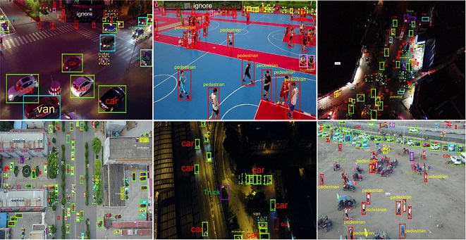

# VisDrone2018

## Task 1 : Object Detection in Images

## Environment
python3.5  tensorflow1.8.0  keras2.1.6

`sudo pip3 install -r requirments.txt`

## Usage
`python train_visdrone.py`

## TODO
- [x] Reading data and label using member function.(VisDroneDataset.load_VisDrone() and VisDroneDataset.load_anno().)
- [x] Writing configuration function.(VidDroneConfig, which is inheriting from class Config.)
- [x] Inspecting data.(load and display random 4 samples.)
- [x] Training network using the modified mask-rcnn algorithm based on VisDrone task.(train_visdrone.py)
- [ ] Using Tensorboard to keep watch on training.
- [ ] Test and submit results to leaderboard
- [ ] Re-design the architecture of our network.

## License
* For academic and non-commercial use only.
* For commercial use, please contact [mhy845879017@gmail.com](https://www.google.com/gmail/).

